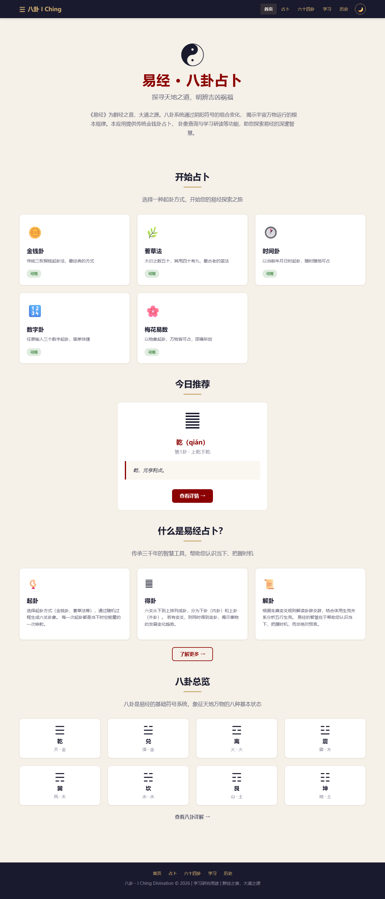
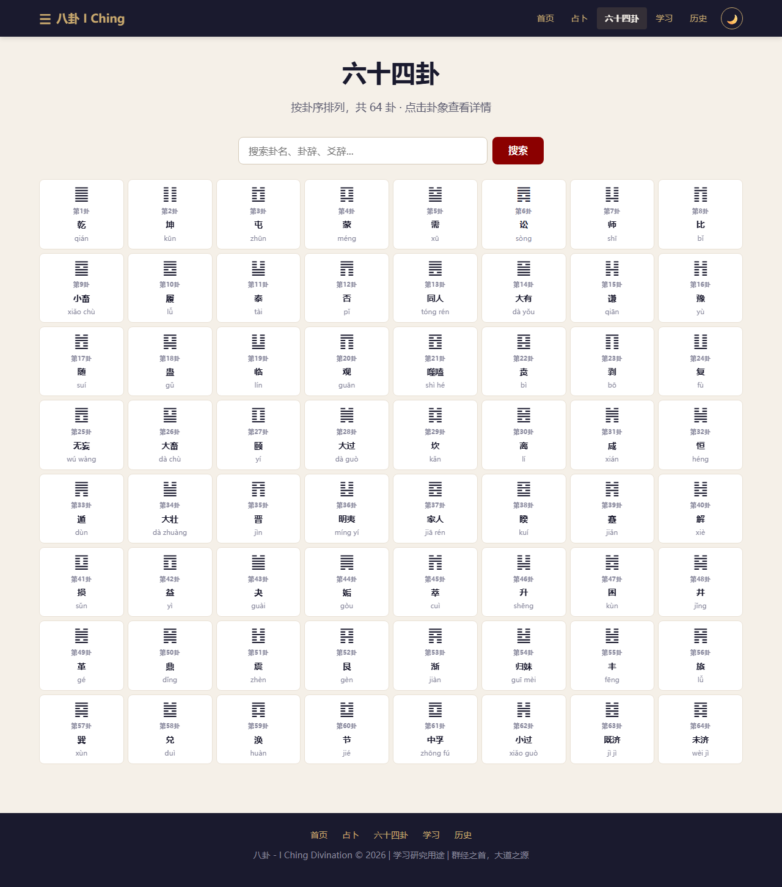
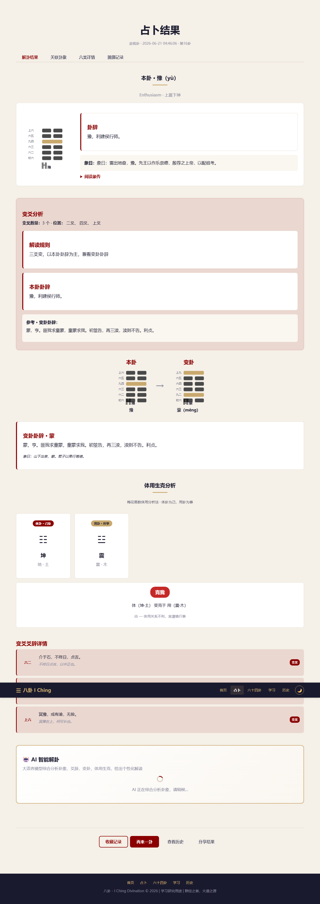

# 八卦 · I Ching Divination

<p align="center">
  
  
  
</p>

一套融合传统易经占卜与现代 AI 智能解卦的 Web 应用。支持 5 种起卦方法，内置 64 卦完整原文数据，可接入 DeepSeek / Anthropic 大模型进行个性化解读。

> A modern web-based I Ching divination tool. 5 casting methods, full classic text reference, AI-powered interpretation via DeepSeek LLM.

## 📸 预览

<p align="center">
  
  
  
  <br><sub>首页 · 六十四卦网格 · AI 智能解卦</sub>
</p>

## ✨ 功能

- **5 种起卦方法**：金钱卦、蓍草法（大衍筮法）、时间卦、数字卦、梅花易数
- **AI 智能解卦**：接入 DeepSeek / Anthropic 兼容 API，综合卦辞爻辞、变卦互卦、体用生克进行全面分析
- **完整卦象分析**：本卦 → 变卦 → 互卦 → 错卦 → 综卦 + 体用生克五行分析
- **朱熹解卦规则**：0-6 变爻全覆盖，含乾坤用九用六特殊处理
- **64 卦参考库**：卦辞、爻辞、彖传、大象传、小象传全文收录
- **隐私优先**：占卜历史存储在浏览器本地 (localStorage)，服务器仅处理占卜引擎和 AI 解卦，不保留个人记录
- **REST API**：完整 JSON 接口，可对接第三方
- **深色主题**：中国传统配色 + 暗色模式切换
- **调试系统**：编号调试日志 `[Dxxx]`，精确定位问题

## 🚀 快速开始

```bash
git clone https://github.com/netlinemelon/iching.git
cd iching
pip install -r requirements.txt
cp .env.example .env          # 编辑 .env 填入 API Key（可选）
python run.py                  # 默认 http://localhost:8088
```

Windows 用户可直接双击 `start.bat`。

## ⚙️ 配置

`.env` 文件（不填 API Key 则使用规则回退解卦）：

```ini
ANTHROPIC_API_KEY=sk-your-key       # DeepSeek API Key
ANTHROPIC_BASE_URL=https://api.deepseek.com/anthropic
ANTHROPIC_MODEL=deepseek-v4-pro
HOST=127.0.0.1
PORT=8088
DEBUG=true
```

## 📡 API

| 端点 | 方法 | 说明 |
|------|------|------|
| `/api/health` | GET | 健康检查 |
| `/api/divine/coin` | POST | 金钱卦 |
| `/api/divine/yarrow` | POST | 蓍草法 |
| `/api/divine/time` | POST | 时间卦 |
| `/api/divine/number` | POST | 数字卦 |
| `/api/divine/plum-blossom` | POST | 梅花易数 |
| `/api/hexagrams` | GET | 六十四卦列表 |
| `/api/hexagrams/{1-64}` | GET | 单卦详情 |
| `/api/hexagrams/search?q=` | GET | 搜索卦象 |
| `/api/history` | GET | 历史记录 |
| `/api/history/export` | GET | 导出 JSON |
| `/api/interpret/{token}` | POST | AI 解卦 |

## 🏗️ 技术栈

| 层 | 技术 |
|----|------|
| 后端 | FastAPI + SQLAlchemy + SQLite |
| 前端 | Jinja2 + Alpine.js + CSS Animations |
| 缓存 | Redis（可选，自动降级） |
| AI | Anthropic SDK → DeepSeek API |

## 📁 项目结构

```
iching/
├── app/
│   ├── engine/          # 起卦算法 + 卦象变换 + 解卦规则
│   ├── routes/           # 页面路由 + REST API
│   ├── models/           # 数据模型 + ORM
│   ├── templates/        # Jinja2 模板 (22个)
│   └── static/           # CSS + JS
├── data/
│   ├── hexagrams.json    # 64卦完整数据
│   └── trigrams.json     # 八卦基础数据
├── run.py                # 一键启动
├── start.bat / start.sh  # 平台启动脚本
└── .env.example          # 配置模板
```

## 🤝 贡献

欢迎 PR。功能规划中：

- [ ] 生辰八字排盘
- [ ] 称骨算命
- [ ] 小六壬
- [ ] 五行缺失分析
- [ ] 每日运势
- [ ] 六爻纳甲排盘

## 📄 协议

MIT License — 详见 [LICENSE](LICENSE)
